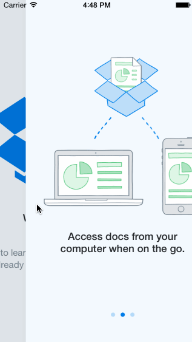

CodePath_Dropbox
=============

This is a dropbox iOS app for welcome screens plus sign in and sign up flow.

### Hours to Complete
3-4 hours for required part. 2 hours researching and implementing the optional part.

### Completed Stories
 * [x] REQUIRED: User can tap through the 3 welcome screens.
 * [x] REQUIRED: User can follow the create user flow.
    * [x] On the create user form, the user can tap the back button to go to the page where they can sign in or create an account.
    * [x] Before creating the account, user can choose to read the terms of service.
    * [x] After creating the account, user can view the placeholders for Files, Photos, and Favorites as well as the Settings screen.
    * [x] User can log out from the Settings screen.
 * [x] REQUIRED: User can follow the sign in flow.
    * [x] User can tap the area for "Having trouble signing in?"
    * [x] User can log out from the Settings screen.
 * [x] OPTIONAL: User is able to swipe through the welcome screens instead of just tapping them.

### Other Notes
 * I implemented the swiping with Swipe Gesture Recognizer, but the transition between screens is not smooth. Using the "scroll view" might be a better way to go. 

### Walkthrough

